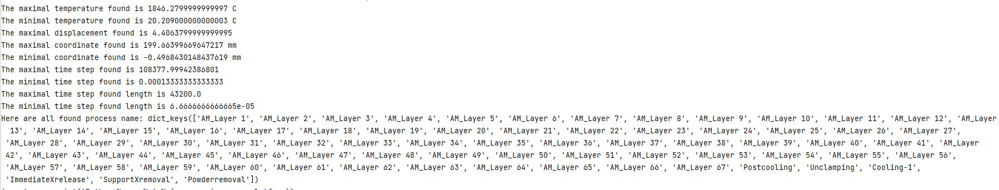

# AMGNN : A Graph neural network for additive manufacturing simulation
___

## Use
This graph neural network is intended to predict the state, step by step of an additive manufacturing process.

## Installation
AMGNN environement was developed on Python 3.9.7, you can install it and its library with Anaconda:
``` conda env create -f environment.yml```

If you want to precise where the environement folder will be created, use the prefix arguement:
``` conda env create --prefix ENV_PATH  -f environment.yml```

Install Simufact arc reader with : 
```pip install git+https://github.com/lerouxl/Simufact_ARC_reader.git@main```

## Configuration
### config.yml
General parameters
### sweep.yml
Sweep parameters of wandb
## Documentation generation:
```pdoc -o ./docs ./utils/config.py```

## Inputs description

This neural network is loading graph as inputs.
The nodes features are:

| ID                	       | Description                                                  	|
|---------------------------|--------------------------------------------------------------	|
| 0                 	       | Laser speed (Normalised by dividing it with `scaling_speed`) 	|
| 1                 	       | Laser power (Normalised by dividing it with `scaling_power`) 	|
| 2                 	       | Layer thickness                                              	|
| 3                 	       | Time step lenght                                             	|
| 4                 	       | Time step                                                    	|
| 5,6,7             	       | Type of node                                                 	|
| 8                 	       | Past node temperature (Normalised by `scaling_temperature`)  	|
| 9                 	       | Past X displacement (Normalised by `scaling_deformation`)    	|
| 10                	       | Past Y displacement (Normalised by `scaling_deformation`)    	|
| 11                	       | Past Z displacement (Normalised by `scaling_deformation`)    	|
| 12                	       | Process features                                             	|
| 13,14,15,16,17,18,19,20 	 | Process category                                             	|
| 21                	       | X coordinate (Normalised by `scaling_size`)                  	|
| 22                	       | Y coordinate (Normalised by `scaling_size`)                  	|
| 23                	       | Z coordinate (Normalised by `scaling_size`)                  	|


## Multi GPUs and nodes supports
If you want to use multiple GPUs and multiple nodes with a SLURM scheduler, you can use the `slurm_multi_gpu.sh` code 
for run with GPUs.

From https://pytorch-lightning.readthedocs.io/en/latest/clouds/cluster_advanced.html#troubleshooting
There are two parametres in the SLURM submission script that determine how many processes will run your training,
the #SBATCH --nodes=X setting and #SBATCH --ntasks-per-node=Y settings.
The numbers there need to match what is configured in your Trainer in the code:
Trainer(num_nodes=X, devices=Y). If you change the numbers, update them in BOTH places.

## Generate a dataset
To transform a Simufact project with multiple simulation into a dataset, this code expected the following folder architure: 
```commandline
dataset_name:
    |__raw:
        |__ Simulation_1
        |__ Simulation_2
        |__ Simulation_3
        |__ ...
        |__ Simulation_n
```
Witch `raw` is the name of the folder where you put all simulation folder (`Simulation_n`) that you copied from your simulation project folder.

Using the script `arc_files_to_csv.py`, you can transform the ARC files into csv files that can be read by python.
To do that modify the script to direct to have `arc_tool_exe_path` to direct to our ArcToolCmd.exe (usualy stored into your Simufact installation).
Then modify `dataset_path` to be the path to your `Simufact_project` folder and run this script.

Now by just running `main.py` the `tmp_arc` and `processed` folder will be created with `processed` containing the different graph representing your dataset.

## Generate a dataset with only AM_layer step

If you want to only apply AMGNN on a dataset with file from the AM_step, it's possible to filter them from the main 
dataset using `utils/dataset_extract_layer_creation_steps.py`

To use it, you need an input folder, the `process` folder where your original dataset is and an output folder, where you
want to save the transformed files.

Example:
```commandline
python utils/dataset_extract_layer_creation_steps.py --input "data\Cubes\processed" --output "data\Cubes_AM_step\processed"
```
For the cubes dataset, this tool take approximately 5 minutes to runs.
The inputs shape is transformed from 24 to 16. 

## Finding normalisation values:
The input of the neural network must be normalised between 0 and 1. To do that, multiple scaling values are available in 
`configs/config_data.yml`. To found the correct value of those variable, the script `dataset_exploration/dataset_normalisation_values.py`
can found the max and min values of the input variable. To run this script, modify the path used line 16 to direct to your dataset.

Here is an example of the output of this script:


With those results we can set:
- scaling_temperature: 1900 (the maximal temperature found) as it will normalise the temperature by dividing it with scaling_temperature (no negative temperature expected)
- scaling_deformation: 5 (the maximal displacement found). It will normalise the deformation by considering the max and min deformation equation to scaling_deformation. Making the normalisation equation equal to (deformation + scaling_deformation) / (2*scaling_deformation)
- scaling_size: 200 (the maximal coordinate found). It will normalisat the size by dividing the coordinate by the scaling_size.
- max_number_of_layer: 70. The max id of AM_Layer list (66 here).It will normalise this feature by dividing it by the max_number_of_layer.
- scaling_time: 110000 (the maximal time step found). Normalise by dividing the time by scaling_time.
- maximal time step found length should be inferior to 50 000. If not, modify `features.py` line 122 by `x_time_step_length = x_time_step_length / <your max value>`


## Performance evaluation

To evaluate the performance of a model, the saved results generated during the test evaluation can be used with the 
shape_comparison.py script with compare the distance between the simulated and AI deformed mesh.

To modify the processed dataset, update the variable super_folder path in the file.
```commandline
python utils/shapre_comparison.py"
```